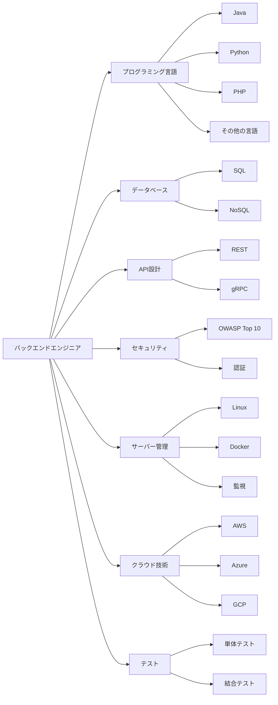
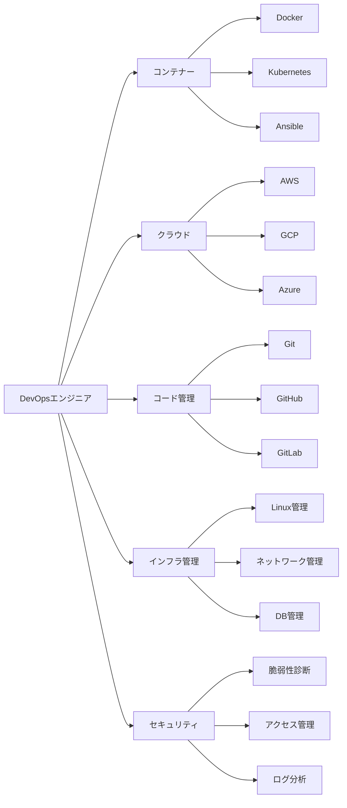

```mermaid
graph LR
A[バックエンドエンジニア] --> B[プログラミング言語]
A --> C[データベース]
A --> D[API設計]
A --> E[セキュリティ]
A --> F[サーバー管理]
A --> G[クラウド技術]
A --> H[テスト]
B --> I[Java]
B --> J[Python]
B --> K[PHP]
B --> L[その他の言語]
C --> M[SQL]
C --> N[NoSQL]
D --> O[REST]
D --> P[gRPC]
E --> Q[OWASP Top 10]
E --> R[認証]
F --> S[Linux]
F --> T[Docker]
F --> U[監視]
G --> V[AWS]
G --> W[Azure]
G --> X[GCP]
H --> Y[単体テスト]
H --> Z[結合テスト]
```

```mermaid
graph LR
A[DevOpsエンジニア] --> B[コンテナー]
A[DevOpsエンジニア] --> C[クラウド]
A[DevOpsエンジニア] --> D[コード管理]
A[DevOpsエンジニア] --> E[インフラ管理]
A[DevOpsエンジニア] --> F[セキュリティ]

B --> B1[Docker]
B --> B2[Kubernetes]
B --> B3[Ansible]

C --> C1[AWS]
C --> C2[GCP]
C --> C3[Azure]

D --> D1[Git]
D --> D2[GitHub]
D --> D3[GitLab]

E --> E1[Linux管理]
E --> E2[ネットワーク管理]
E --> E3[DB管理]

F --> F1[脆弱性診断]
F --> F2[アクセス管理]
F --> F3[ログ分析]
```
