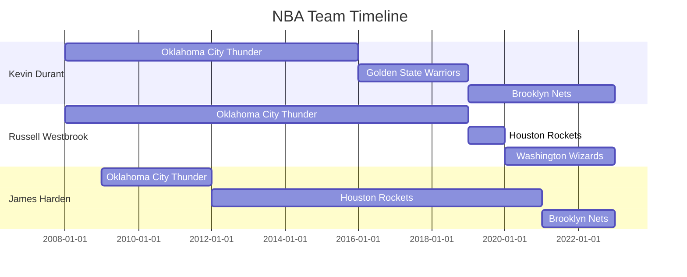
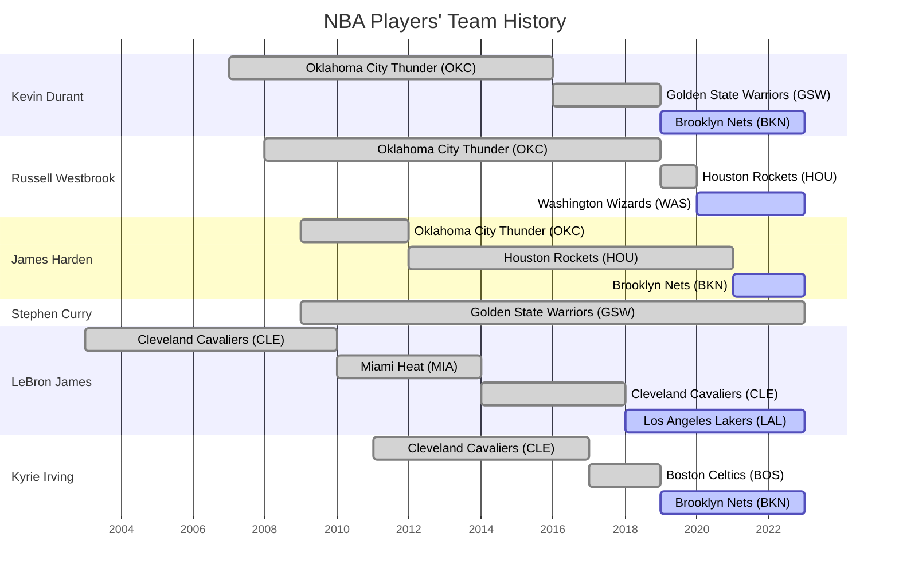

```mermaid
gantt
    dateFormat  YYYY
    title NBA Team Timeline

    section Kevin Durant
    Oklahoma City Thunder : 2008, 2016
    Golden State Warriors : 2016, 2019
    Brooklyn Nets : 2019, 2023

    section Russell Westbrook
    Oklahoma City Thunder : 2008, 2019
    Houston Rockets : 2019, 2020
    Washington Wizards : 2020, 2023

    section James Harden
    Oklahoma City Thunder : 2009, 2012
    Houston Rockets : 2012, 2021
    Brooklyn Nets : 2021, 2023
```

```mermaid
gantt
title NBA Players' Team History
dateFormat  YYYY
axisFormat %Y
section Kevin Durant
Oklahoma City Thunder (OKC) :done, 2007, 2016
Golden State Warriors (GSW) :done, 2016, 2019
Brooklyn Nets (BKN) :active, 2019, 2023
section Russell Westbrook
Oklahoma City Thunder (OKC) :done, 2008, 2019
Houston Rockets (HOU) :done, 2019, 2020
Washington Wizards (WAS) :active, 2020, 2023
section James Harden
Oklahoma City Thunder (OKC) :done, 2009, 2012
Houston Rockets (HOU) :done, 2012, 2021
Brooklyn Nets (BKN) :active, 2021, 2023
section Stephen Curry
Golden State Warriors (GSW) :done, 2009, 2023
section LeBron James
Cleveland Cavaliers (CLE) :done, 2003, 2010
Miami Heat (MIA) :done, 2010, 2014
Cleveland Cavaliers (CLE) :done, 2014, 2018
Los Angeles Lakers (LAL) :active, 2018, 2023
section Kyrie Irving
Cleveland Cavaliers (CLE) :done, 2011, 2017
Boston Celtics (BOS) :done, 2017, 2019
Brooklyn Nets (BKN) :active, 2019, 2023
```
