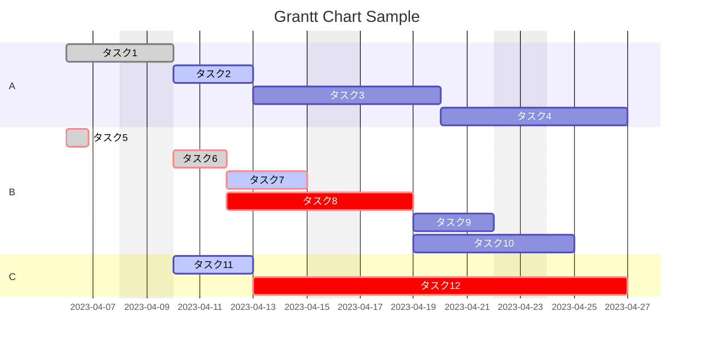

```mermaid
gantt
    dateFormat  YYYY-MM-DD
    title       Grantt Chart Sample
    excludes    weekends
    %% (`excludes` accepts specific dates in YYYY-MM-DD format, days of the week ("sunday") or "weekends", but not the word "weekdays".)

    section A
    タスク1 :done,    task1, 2023-04-06,2023-04-10
    タスク2 :active,  task2, after task1, 3d
    タスク3 :         task3, after task2, 5d
    タスク4 :         task4, after task3, 5d
    
    section B
    タスク5 :crit, done,   task5,  2023-04-06,  20h
    タスク6 :crit, done,   task6,  after task1, 2d
    タスク7 :crit, active, task7,  after task6, 3d
    タスク8 :crit,         task8,  after task6, 5d
    タスク9 :              task9,  after task8, 3d
    タスク10 :             task10, after task8, 4d
    
    section C
    タスク11 :      active, task11, after task1,  3d
    タスク12 :crit,         task12, after task11, 10d

```

### references
https://mermaid.js.org/syntax/gantt.html

