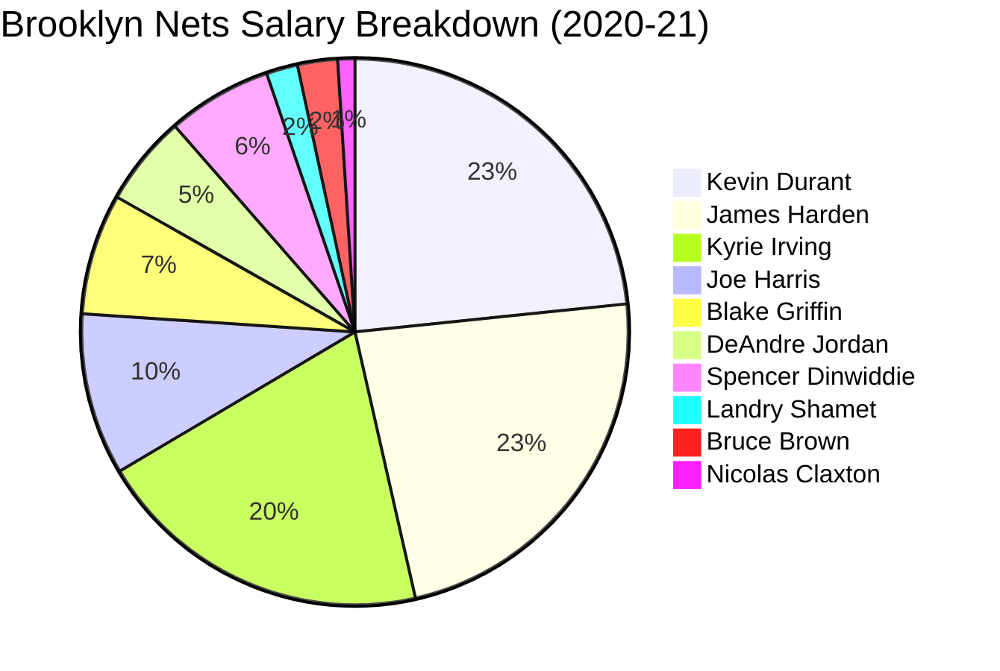
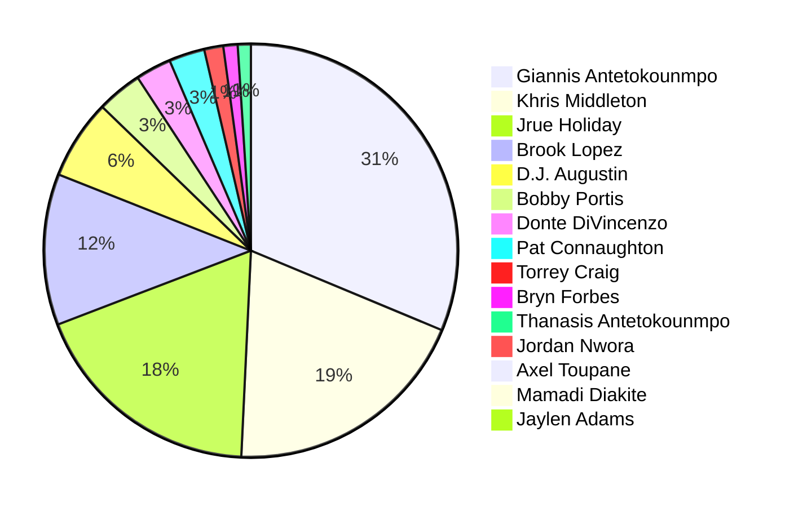

<!-- 値 -->

```mermaid
pie
  title Brooklyn Nets Salary Breakdown (2020-21)
  "Kevin Durant" : 41500000
  "James Harden" : 41000000
  "Kyrie Irving" : 35600000
  "Joe Harris" : 17000000
  "Blake Griffin" : 12700000
  "DeAndre Jordan" : 9520000
  "Spencer Dinwiddie" : 11000000
  "Landry Shamet" : 3300000
  "Bruce Brown" : 4200000
  "Nicolas Claxton" : 1800000
```

<!-- 割合 -->

```mermaid
pie
    "Giannis Antetokounmpo" : 33.6
    "Khris Middleton" : 20.9
    "Jrue Holiday" : 19.8
    "Brook Lopez" : 12.7
    "D.J. Augustin" : 6.7
    "Bobby Portis" : 3.8
    "Donte DiVincenzo" : 3.0
    "Pat Connaughton" : 3.0
    "Torrey Craig" : 1.6
    "Bryn Forbes" : 1.2
    "Thanasis Antetokounmpo" : 1.1
    "Jordan Nwora" : 0.9
    "Axel Toupane" : 0.4
    "Mamadi Diakite" : 0.3
    "Jaylen Adams" : 0.1
```
